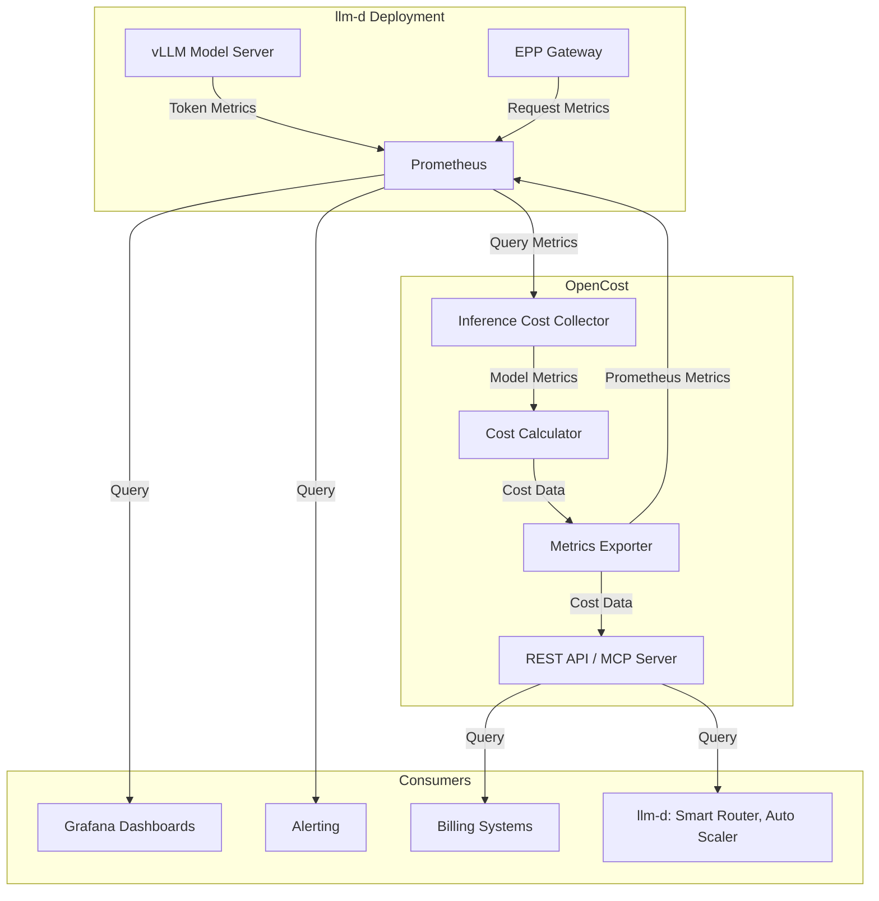

# AI Inference Cost Metrics for llm-d

Authors: Sima Nadler (_IBM_), Alex Meijer (_OpenCost_, _IBM_)

## Summary

This proposal introduces cost tracking for **AI inference deployed on llm-d**. The solution enables:
* tracking of self-hosted AI model costs
* enabling cost tracking across teams and workloads
* optimization of inference routing 
* resource allocation and waste detection
based on actual per-token costs calculated from infrastructure usage.

Cost tracking provides unified visibility across Kubernetes infrastructure, cloud resources, and self hosted AI inference workloads.  This enables organizations to make data-driven decisions about model deployment configurations, compare self-hosting costs against commercial API alternatives, and measure the return on investment of optimization techniques like KV cache and disaggregated serving.

## Motivation

As organizations scale their AI inference deployments on llm-d, understanding and optimizing  costs becomes critical. Platform teams need visibility into the actual cost of serving different models, workloads, and teams to make informed decisions about resource allocation, capacity planning, routing and optimization priorities.  Management teams need insight into costs versus benefits of investing in LLM optimization and infrastructure upgrades and an overall view into the efficiency of their AI footprint.

Current challenges include:
- **Lack of cost visibility**: Teams don't know the actual inference cost per token for the self host models they use
- **No chargeback mechanism**: Cannot attribute costs to specific teams or workloads for internal billing
- **Optimization blindness**: Cannot measure the cost impact of optimizations such as KV cache hits, disaggregated serving and smart routing
- **Self-hosting vs API comparison**: Cannot compare self-hosting costs against commercial API alternatives because the self hosting costs are not known
- **Resource allocation**: Cannot make data-driven decisions about which models or configurations to prioritize
- **Multi-tenant cost allocation**: Cannot fairly distribute infrastructure costs across multiple teams and workloads sharing the same model servers
- **GPU Efficiency Opacity**: Limited ability to right size underlying GPU infrastructure to actual observed workload resource requirements 

### Goals

1. **Infrastructure-based cost calculation**: Calculate per-token costs from actual infrastructure use (ex: GPU, CPU, memory infrastructure usage) not pre-configured pricing tables
2. **Multi-dimensional attribution**: Track costs by team, workload, model, model variant, label and namespace
3. **Differentiated token pricing**: Provide separate costs for input (prompt) and output (generation) tokens based on actual compute time
4. **Seamless integration**: Integrate with existing llm-d metrics ecosystem (DCGM, vLLM, EPP, GPU metrics) without duplication
5. **Disaggregation support**: Track costs for disaggregated serving (prefill/decode) deployments
6. **Production-ready**: Provide reliable, scalable cost tracking suitable for production deployments
7. **Optimization insights**: Enable measurement of cost savings from KV cache, prefix caching, and other optimizations
8. **LLM/GPU workload idle insights**: Improve on OpenCosts current GPU capabilities to better identify GPU idle

Note: Although not a direct goal of this project, collection of SaaS Model Provider usage and billing can be obtained via OpenCost via its plugin mechanism.  This makes comparing self hosted costs to SaaS model costs much easier.  Currently there is a [plugin for OpenAI](https://github.com/opencost/opencost-plugins/tree/main/pkg/plugins/openai).

### Non-Goals

1. **Not replacing existing metrics**: This proposal does not replace llm-d's existing performance and operational metrics
2. **Not a billing system**: This is not a billing/invoicing system, but provides cost data for such systems
3. **Not for training costs**: Focus is exclusively on inference costs, not model training nor fine-tuning.  Changes made to OpenCost, however, will be made with an eye towards enabling future work such as training cost support. 
4. **Not real-time billing**: Cost calculations are based on recent metrics (5-minute windows), not per-request billing
5. **Not pricing**: This proposal provides costs not prices.  If static or dynamic pricing is desired it can be generated using inference costs as a basis.

## Cost Metrics Primer

For background on infrastructure cost concepts (alloccation-based vs usage-only costs, idle, wasted, and shared costs), see the [Cost Metrics Primer](./cost-metrics-primer.md).  

_This is important for understanding the following sections._

### User Stories

#### Story 1: Platform Team Cost Optimization

As an inference platform team managing multiple AI model and/or llm-d deployments, I want to track infrastructure costs per model and variant so I can identify which configurations are most cost-effective and make data-driven decisions about resource allocation.

**Acceptance Criteria**:
- View cost per million tokens for each model
- Compare costs across different infrastructure configurations - ex: GPU types and configurations
- Identify models with highest infrastructure costs
- Track cost trends over time

#### Story 2: Platform Team Cost-Based Routing Optimization

As a platform team managing llm-d deployments, I want to use cost metrics to optimize routing decisions so I can direct requests to the most cost-effective models and model variants and configurations while maintaining SLO compliance.  The models may be self-hosted or externally provided.

**Acceptance Criteria**:
- Access cost per token metrics for different self-hosted models and model variants
- Route requests to lower-cost models or model variants when SLOs permit
- Track cost savings from intelligent routing decisions
- Balance cost optimization with latency and throughput requirements
- Measure cost reduction from routing optimization over time

#### Story 3: Executive Team Strategic Decisions

As an executive team, I am interested in using llm-d for self-hosting but also want to compare self-hosting costs against commercial API alternatives so I can make informed decisions about our AI infrastructure strategy.

**Acceptance Criteria**:
- View total cost per million tokens for self-hosted models
- Compare against commercial API pricing - collection of commercial API bills out of scope but may be offered by OpenCost via plugins
- Understand cost breakdown (GPU, memory, network)
- Project costs at different scale levels

#### Story 4: Finance Team Chargeback

As a finance team member, I want to attribute AI inference costs to specific application teams and workloads so that I have the necessary information to perform accurate chargeback and showback for internal billing purposes.  (**Billing is out of scope**) 

**Acceptance Criteria**:
- Query costs by namespace and team labels
- Generate cost reports for billing periods
- Export cost data for integration with billing systems
- Track costs by workload type (interactive vs batch)
- Track costs for specific workloads - including agents

#### Story 5: FinOps Support/Unit Economics
As a FinOps team member, I want to view underutilized LLM deployments and their underlying hardware. I want to know the amount of savings that would be realized by right-sizing the LLM deployment. I also want to establish the unit economics of LLM scaling to justify CAPEX. 

**Acceptance Criteria**:
- View idle resources by type, particularly GPUs
- Determine which teams/deployments are over-provisioned and inefficient
- Be able to spread out idle GPU costs across all LLM consumers
- Determine the effect on cost-per-token for each marginal GPU added or removed
- Make recommendations for optimizations or best practices at large and small scale LLM deployment

## Proposal

This proposal recommends adding infrastructure cost tracking for AI inference workloads on llm-d. After evaluating multiple approaches (detailed in the [Alternatives section](#alternatives-to-opencost)), we recommend **extending OpenCost** with a new inference cost domain that tracks AI inference costs alongside OpenCost's existing cost domains (Allocation, Asset, CloudCost, CustomCost).

### Why OpenCost?

[OpenCost](https://opencost.io/) provides a good foundation for inference cost tracking because it:
- Already integrates with Kubernetes and monitoring software including Prometheus
- Has proven cost allocation algorithms for GPU infrastructure, which will be enhanced in the course of this project
- Provides unified visibility across infrastructure, cloud, and custom costs
- Offers REST API and MCP server for programmatic access
- Is open source and widely adopted in the Kubernetes ecosystem- 7,000 stars on github and in CNCF incubating status
- Collects general infrastructure costs - CPU, memory, network, overhead, etc.
- Open plugin architecture allows for extension to arbitrary costs

### Alternative Approaches Considered

We evaluated several approaches before recommending OpenCost:

1. **Custom metrics in llm-d**: Would duplicate OpenCost's infrastructure cost tracking
2. **Commercial tools**: Conflicts with open source philosophy and adds licensing costs
3. **Manual tracking**: Not scalable for production deployments
4. **Pre-configured pricing**: Less accurate than infrastructure-based calculation

The OpenCost approach provides the best balance of accuracy, integration, and maintainability.

### High-Level Architecture

```
┌─────────────────────────────────────────────────────────────┐
│                         OpenCost                            │
│  ┌──────────────┐  ┌──────────────┐  ┌──────────────┐       │
│  │  Allocation  │  │  CloudCost   │  │  Inference   │ NEW   │
│  │    Costs     │  │    Costs     │  │    Costs     │       │
│  └──────────────┘  └──────────────┘  └──────────────┘       │
│                            │                                │
│                   ┌────────▼────────┐                       │
│                   │   MCP Server    │                       │
│                   │   REST API      │                       │
│                   └─────────────────┘                       │
└─────────────────────────────────────────────────────────────┘
                             │
                 ┌───────────┴───────────┐
                 │                       │
         ┌───────▼────────┐     ┌───────▼────────┐
         │   Prometheus   │     │   llm-d vLLM   │
         │   (Metrics)    │     │   + EPP        │
         └────────────────┘     └────────────────┘
```

### Core Approach

In addition to collecting and calculating general infrastructure costs as is already done by OpenCost today, we will add inference specific cost metrics.

1. **Collect metrics from existing sources**:
   - Token metrics from vLLM (ex: `vllm:prompt_tokens_total`, `vllm:generation_tokens_total`)
   - GPU costs from OpenCost's existing allocation system
   - GPU requests from DRA and device plugins
   - GPU utilization 
   - Processing time metrics from vLLM for differentiated pricing
   - KV cache hits and usage metrics
   - Namespace and model labels for attribution

2. **Calculate infrastructure-based costs**:
   - Determine total cost per container based on allocation and node costs
   - Calculate total tokens processed in time window
   - Compute cost per token from infrastructure costs divided by token throughput as well as based on usage
   - Allocate costs between input and output tokens based on actual processing time
   - Calculate cache saving due to optimizations such as KV cache hits, prefill/decode separation, and smart routing
   - Identify idle costs - a key metric needed to enable optimization of infrastructure 
   - Provide both usage and allocation cost basis metrics

3. **Export cost metrics**:
   - Prometheus metrics for monitoring and alerting
   - REST API for programmatic access
   - MCP server for agentic interactions
   - OpenCost UI for AI model costs

4. **Enable multi-dimensional queries**:
   - Aggregate by model, namespace, team/tenant, workload
   - Filter by time windows
   - Compare costs across different configurations - i.e. model variants
   - Monitor model and model variant idle costs

## Design Details

The proposal is to:
1. Define and standardize inference cost metrics
2. Provide a default implementation based on OpenCost that generates and provides access to the metrics

The goal is to provide a fully functional cost solution for llm-d using OpenCost, but allowing for it to be replaced as long as the replacement for OpenCost is able to generate the same metrics and provides the same APIs.


### Implementation Status

The proposal is based on a **working proof of concept**, which demonstrates:

- Basic cost metrics (total cost, cost per million tokens)
- Differentiated input/output costs with compute-time allocation - simple, gpu only, no kv cache calculations

The [POC implementation](https://github.com/simanadler/opencost/tree/initial-inference) validates the overall approach and feasibility of using OpenCost, and does not aim to provide fully accurate costs.

## High Level Design Proposal

### LLM costs

_For background on infrastructure cost concepts (allocation-based vs usage-only costs, idle, wasted, and shared costs), see the [Cost Metrics Primer](cost-metrics-primer.md)._

LLM inference introduces all four cost components in a more extreme form than typical CPU workloads, and both cost metrics are useful enough that we propose to expose them directly.

For this initial discussion we focus on GPUs to simplify things.

- **Used** — GPU compute actively processing inference requests (tokens being generated)
- **Wasted** — GPU memory holding model weights while no requests are arriving (model loaded but idle between requests)
- **Idle** — GPUs with no model loaded at all or with a model but requesting more resources than required
- **Shared** — Typical kubernetes shared costs **plus kv cache** and other inference specific shared costs described [here](#beyond-just-gpu)

The gap between "used" and "wasted" can be far larger for LLMs than for CPU workloads. A CPU workload can be bin-packed with others to fill spare capacity. An LLM model loaded onto a GPU blocks that GPU entirely — its weights occupy VRAM whether or not a request is in flight, and loading/unloading is slow and expensive. A low-traffic model may spend 95% of its time in the "wasted" state.

The following are the proposed metrics to be added to support AI Inferencing.  

**Proposed LLM Cost Metrics**:

- `llm_total_cost`: Hourly cost per model
- `llm_cost_per_million_tokens`: Blended cost per 1M tokens - without kv cache savings
- `llm_input_cost_per_million_tokens`: Cost per 1M **input tokens** - without kv cache savings
- `llm_output_cost_per_million_tokens`: Cost per 1M **output** tokens
- `llm_total_kv_cache_savings`: Hourly savings due to KV cache hits
- `llm_kv_cache_savings_per_million_tokens`: KV cache savings per million tokens


**Cost Metric Labels**: 

New labels:
* model_name="meta-llama/Llama-3.1-8B-Instruct" (example)
* model_version="v1.0" (example)
* model_variant="LoRa A" (example)
* cost_basis="usage" or "allocation"
* workload="inference" (for llm-d)

Existing OpenCost labels:
* namespace="customer-support-llm" (example)
* product="customer-support-agent" (example)
* allocation="productA-support-team" (example)
* share_split="weighted", "equal", "none", "proportional" 
* share_idle="distributed", "separate", "none" 

The following section describe the metrics in more detail.

### Overall Model Cost Metrics 

**Allocation-based cost per model** counts everything attributed to running that model: the GPU memory reserved for its weights at all times, the compute consumed during active inference, and its share of shared of infrastructure. This is the cost of *having the model available*. It reconciles to your infrastructure bill and answers: *"what is this model costing us?"*

**Usage-based cost per model** counts only the GPU and other infrastructure consumed during active inference — the tokens actually generated minus costs saved by kv cache hits. This answers: *"what did this model's actual work cost?"* The gap between this and the allocation-based figure is the cost of keeping the model warm and ready, which is a business decision about acceptable latency, not a technical inefficiency.

### Cost Per Million Tokens 

Both cost metrics produce a corresponding cost per million tokens figure, but they answer different questions.

**Usage-based Cost per Million Tokens** measures the intrinsic cost of inference — what each token costs in pure compute terms. This is stable regardless of how busy the model is, making it the right metric for comparing the efficiency of different models or hardware configurations against each other, or against external API pricing for the inference work itself.

**Allocation-based Cost Per Million Tokens** measures the real business cost of each token when you factor in the full price of keeping the model available, including idle time. This varies with utilization — the same model serving fewer requests will show a higher allocation-based cost per token because the fixed hosting cost is spread across fewer tokens.

The relationship between the two directly expresses utilization without needing a separate metric:

```
utilization = usage-based cost per million tokens / allocation-based cost per million tokens

Example:
  Usage-based:       $1.00 per million tokens  (intrinsic inference cost)
  Allocation-based:  $4.00 per million tokens  (full hosting cost)
  Utilization:       25%  (model is busy 1/4 of the time)
```

These metrics will be broken down further into the cost per million **input** and **output** tokens.  In order to calculate input token cost it is necessary to capture kv cache hit savings, which will also be provided as a metric.

**Cost Per Million Tokens - with KV Cache Hits**

To calculate the actual cost per million tokens its necessary to do the following calculation:

```actual_cost_per_million_tokens = llm_cost_per_million_tokens - llm_kv_cache_savings_per_million_tokens```

or if you want specifically for input tokens only:

```actual_cost_per_million_input_tokens = llm_cost_per_million_input_tokens - llm_kv_cache_savings_per_million_tokens```

The reason for this approach is that SaaS model providers charge in this manner.  I.e. Cost per million tokens without KV cache hits, and a separate summary of KV cache hits.

### Beyond Just GPU 

There are other costs associated with self hosting an AI model via llm-d which must also be captured:
| Component | Chart | Scope | Notes |
|---|---|---|---|
| **Inference Scheduler / EPP** | `inferencepool` (gateway-api-inference-extension) | **1:1 with InferencePool*** | CPU-only; routes all traffic for the pool |
| **llm-d-infra / Gateway proxy** | `llm-d-infra` | **1:1 with InferencePool** | Sets up gateway; may include a proxy pod |
| **Async Processor** | `async-processor` | **1:1 with InferencePool** | Present only in async-processing deployments; points to single gateway URL |
| **Workload Variant Autoscaler (WVA)** | `workload-variant-autoscaler` | **Cluster-wide by default** | Watches all namespaces unless `namespaceScoped: true`; sole cross-pool component |
| **KV-cache PVC** | manual PVC / `llm-d-kv-cache-storage` | **Per model or shared across model variants** | Can be up to 18TB in tiered-cache deployments |

    Note: An InferencePool is an llm-d resource that groups a set of model server replicas (pods) behind a single logical endpoint. It is the unit of deployment for a model in llm-d: the Inference Scheduler (EPP), gateway proxy, and other per-model infrastructure components are each scoped 1:1 to an InferencePool.  Different models within an InferencePool are referred to as model variants.


  **Recommendation**: Treat KV cache as a model allocation cost for the purposes of cost attribution. 

    The reason is that KV cache capacity is sized at deployment time based on expected concurrency, not actual requests — the operator makes a deliberate choice to reserve X GB for KV cache when deploying the model. Charging it to usage would obscure that capacity decision and make usage-based costs misleadingly low for
    memory-intensive models.

    There are situations where portions of the KV cache are offloaded to disk when VRAM is exhausted.  This memory is consumed in proportion to actual request load — more concurrent requests means more KV cache pages in use. This is closer to a usage cost since it scales with actual inference activity - but we will defer addressing this initially.

    In deployments where llm-d's architecture separates prefill and decode with a shared KV cache, the models sharing the KV cache are variants of the same model - i.e. they have different hardware and/or LoRa configurations but use the same model and version.  Thus, from a cost perspective we view them as a single model.
  
  
### The useful combination

The two per-model cost figures and the two per-token figures together give a complete picture:

| Allocation  cost | Usage-based cost per million tokens | What it means |
|------------------|--------------------------------------|---------------|
| High             | Low                                  | Costly to keep available, but efficient at inference — utilization is the problem, consider shared serving |
| High             | High                                 | Costly to keep available *and* expensive to run — evaluate whether the model is the right choice |
| Low              | Low                                  | Cheap to host and efficient — well-sized deployment |
| Low              | High                                 | Cheap to host but the inference itself is costly — look at model size, quantization, or hardware fit |

### Comparing against external API pricing

When deciding whether to self-host or use an external API, the comparison must be made against **allocation-based cost per million tokens**, not usage-based. Usage-based cost per token reflects only active compute and will almost always make self-hosting look cheaper than it is. The allocation-based figure captures the full cost of availability — which is exactly what an external API provider is also charging you for.

```
Self-hosted model:
  Usage-based cost per million tokens:       $1.00  (compute only)
  Allocation-based cost per million tokens:  $4.00  (full hosting cost)

External API price per million tokens:       $2.00

Conclusion: external API is cheaper — self-hosting at 25% utilization costs $4.00/M tokens,
            not $1.00. Raising utilization above 50% would make self-hosting competitive.
```


### Architecture Diagram 

The following shows the proposed architecture.  
Note that the models running in llm-d generate input to OpenCost, while llm-d components such as the smart router (under development) and AutoScaler may be clients of the Inference costs generated by OpenCost.

View with mermaid extension or [view image](./diagrams/costarchitecture.png)



### Roadmap

**Proof of Concept** [implementation](https://github.com/simanadler/opencost/tree/initial-inference)
- ✅ Basic cost metrics (total cost, cost per million tokens)
- ✅ Multi-namespace support
- ✅ Prometheus metrics export
- ✅ Differentiated input/output token costs


**Implementation Tasks**:
- **Task 1**: Add idle, CPU, RAM, Networking, KV Cache and overhead costs to inference costs
- **Task 2**: Integration with OpenCost UI and APIs
- **Task 3**: GPU efficiency
- **Task 4**: Workload and team-based attribution 
- **Task 5**: Optimization cost tracking and savings calculation (KV cache, prefill/decode, smart routing)
- **Task 6**: Testing and validation framework

## Alternatives to OpenCost

### Alternative 1: Custom Metrics in llm-d

**Approach**: Add cost calculation directly to llm-d components (EPP, vLLM sidecars).

**Pros**:
- Tighter integration with llm-d
- No dependency on OpenCost

**Cons**:
- Duplicates OpenCost's proven cost allocation logic
- Requires reimplementing infrastructure cost tracking
- No unified view with Kubernetes and cloud costs
- More maintenance burden on llm-d team
- Obtaining 3rd party LLM usage and billing information would have to be implemented and maintained, rather than having it done via the OpenCost community

**Decision**: Rejected - OpenCost provides better infrastructure for cost tracking.

### Alternative 2: Commercial Cost Management Tools

**Approach**: Use commercial tools like Kubecost, CloudHealth, or Datadog.

**Pros**:
- Feature-rich with UI and reporting
- Professional support

**Cons**:
- Not open source
- Vendor lock-in
- Additional licensing costs
- May not support AI-specific metrics

**Decision**: Rejected - Conflicts with llm-d's open source philosophy.

### Alternative 3: Manual Cost Tracking

**Approach**: Calculate costs manually using spreadsheets and periodic metric exports.

**Pros**:
- No additional infrastructure
- Full control over calculations

**Cons**:
- Not scalable
- Error-prone
- No real-time visibility
- High operational overhead

**Decision**: Rejected - Not suitable for production deployments.

### Alternative 4: Pre-configured Pricing Tables

**Approach**: Use fixed per-token pricing based on model size and GPU type.

**Pros**:
- Simpler implementation
- Predictable costs

**Cons**:
- Doesn't reflect actual infrastructure usage
- Requires manual price updates
- Doesn't account for optimizations (cache hits, utilization)
- Less accurate for cost attribution

**Decision**: Rejected - Infrastructure-based calculation is more accurate.


## Success Criteria

This proposal will be considered successful when:

1. **Adoption**: llm-d includes guidance and examples for how to provide cost using OpenCost and internal components such as AutoScaler and Smart Routing use the generated costs
2. **Integration**: llm-d guides include OpenCost deployment instructions
3. **Validation**: Cost metrics validated against cloud billing for accuracy
4. **Usage**: Multiple organizations using cost metrics in production
5. **Feedback**: Positive feedback from platform teams on cost visibility
6. **Optimization**: Documented case studies of cost optimization using metrics

## Next Steps

1. **Community Review**: Present proposal to llm-d community for feedback
2. **Upstream**: Contribute OpenCost changes to upstream OpenCost project
6. **Roadmap**: Plan implementation based on community feedback